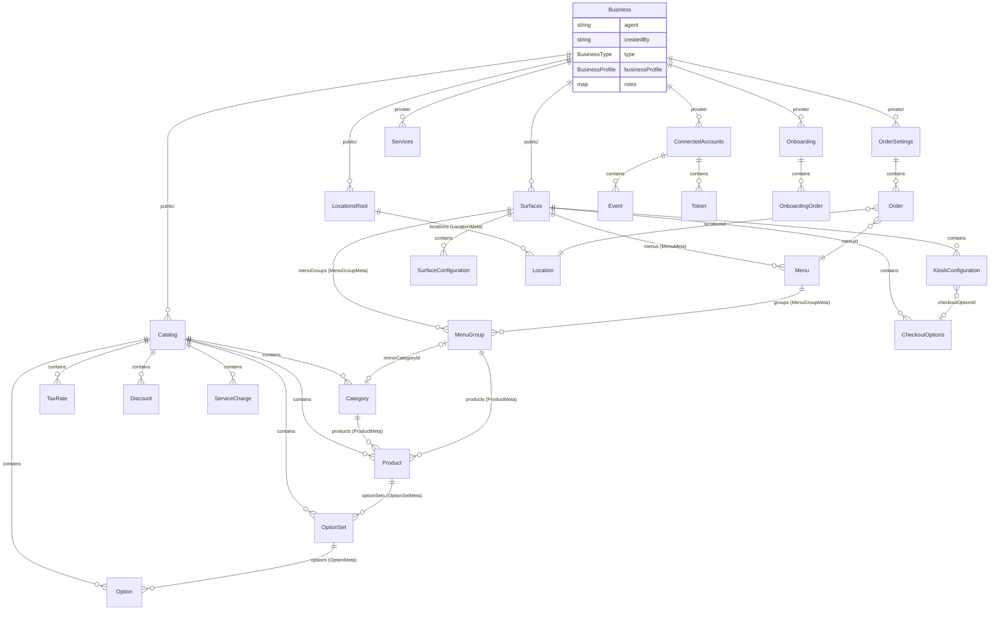

# Restaurant-Core

A TypeScript library that provides domain models and persistence for multi-location restaurant management. Built on Firebase/Firestore as an NPM package (`@kiosinc/restaurant-core`).

## Features

- **Business Management** - Multi-location restaurant organization with roles and profiles
- **Catalog System** - Products, categories, options, pricing, tax rates, and inventory tracking
- **Order Processing** - Order management with state machine and payment workflows
- **Menu & Kiosk Configuration** - Self-service ordering system setup and menu definitions
- **External Integrations** - Connected accounts for POS systems (e.g., Square) with event synchronization
- **Reporting** - Daily metrics and location-specific reports
- **Authentication** - Express middleware for Firebase Auth with role-based access

## Tech Stack

- TypeScript (compiled to CommonJS)
- Firebase Admin / Firestore
- Google Cloud Tasks
- Express (authentication middleware)

## Installation

```bash
npm install @kiosinc/restaurant-core
```

## Project Structure

```
src/
├── domain/                    # Pure TypeScript domain models (no Firebase imports)
│   ├── catalog/               #   Product, Category, OptionSet, Option, TaxRate, Discount, ServiceCharge
│   ├── orders/                #   Order, OrderSymbols (state enums)
│   ├── surfaces/              #   Menu, MenuGroup, KioskConfiguration, CheckoutOptions, SurfaceConfiguration
│   ├── locations/             #   Location
│   ├── connected-accounts/    #   Event, Token
│   ├── roots/                 #   Business, Catalog, Surfaces, Locations, Orders, ConnectedAccounts, Services, Onboarding
│   ├── onboarding/            #   OnboardingOrder
│   ├── misc/                  #   Address, BusinessProfile (value objects)
│   ├── services/              #   CatalogCascadeService (pure domain logic)
│   ├── BaseEntity.ts          #   Base interface for all domain models
│   ├── MetadataSpec.ts        #   Denormalization contract
│   ├── LinkedObjectRef.ts     #   External provider cross-references
│   └── validation.ts          #   Validation helpers
│
├── persistence/               # Firestore repositories, converters, metadata
│   ├── MetadataRegistry.ts    #   Model key → MetadataSpec registry
│   └── firestore/
│       ├── FirestoreRepository.ts  # Generic CRUD with transactional metadata updates
│       ├── PathResolver.ts         # All Firestore document/collection path resolution
│       ├── BusinessFactory.ts      # Transactional business creation (all 8 root docs)
│       ├── LinkedObjectQueries.ts  # Query by external provider ID
│       ├── converters/             # Per-model Firestore serialization
│       └── handlers/               # Cascade relationship handlers (parent updates on child save)
│
├── firestore-core/            # Path constants and enums
│   ├── Paths.ts               #   CollectionNames enum, Environment enum
│   ├── Constants.ts           #   Provider enum, Semaphore enum
│   └── core/DistributedCounter.ts
│
├── restaurant/                # Legacy modules (not yet migrated)
│   ├── connected-accounts/EventNotification.ts  # RTDB-based notifications
│   └── vars/SemaphoreV2.ts                      # Firestore-based distributed lock
│
├── user/                      # Express authentication middleware
│   ├── Authentication.ts      #   authenticate() and isAuthenticated() middleware
│   ├── Claims.ts              #   JWT claims with business roles
│   ├── User.ts                #   User interface
│   └── UserRequest.ts         #   Firebase ID token verification
│
├── reports/                   # Reporting models
│   ├── DailyKeyMetricReportV2.ts
│   ├── LocationKeyMetricReport.ts
│   └── ReportTaskEvent.ts
│
├── utils/                     # Infrastructure utilities
│   ├── GoogleCloudTask.ts     #   Cloud Tasks HTTP POST creator
│   ├── schedule.ts            #   BusinessHours, Period
│   ├── geo.ts                 #   Coordinates (geohash + lat/lng)
│   └── bigInt.ts              #   BigInt JSON serialization
│
└── index.ts                   # Barrel exports (namespace-style)
```

## Architecture

### Layer Separation

The codebase separates pure domain logic from persistence:

```
┌──────────────────────────────────┐
│         src/domain/              │  Pure TypeScript — no Firebase imports
│   interfaces + factory functions │  Testable without infrastructure
└───────────────┬──────────────────┘
                │ depends on
┌───────────────▼──────────────────┐
│       src/persistence/           │  Firestore repositories, converters,
│   FirestoreRepository<T>        │  transactional metadata updates
└──────────────────────────────────┘
```

### Domain Models

Every domain model is a TypeScript **interface** extending `BaseEntity`, paired with a `create*()` factory function. No class inheritance.

```typescript
interface BaseEntity {
  readonly Id: string;
  readonly created: Date;
  updated: Date;
  readonly isDeleted: boolean;
}
```

Models that track denormalized summaries also export a `*Meta` interface and `*meta()` function (e.g., `ProductMeta`, `productMeta()`).

### Aggregate Roots

Each business has 8 singleton root documents that hold denormalized maps of their child entities:

| Root | Path | Denormalized Maps |
|------|------|-------------------|
| Business | `/businesses/{id}` | — |
| Catalog | `/businesses/{id}/public/catalog` | — |
| Surfaces | `/businesses/{id}/public/surfaces` | `menus`, `menuGroups` |
| LocationsRoot | `/businesses/{id}/public/locations` | `locations` |
| OrderSettings | `/businesses/{id}/private/orders` | — |
| ConnectedAccounts | `/businesses/{id}/private/connectedAccounts` | — |
| Services | `/businesses/{id}/private/services` | — |
| Onboarding | `/businesses/{id}/private/onboarding` | — |

### Firestore Document Tree

```
/businesses/{businessId}
├── /public/catalog
│   ├── /categories/{id}
│   ├── /products/{id}
│   ├── /optionSets/{id}
│   ├── /options/{id}
│   ├── /taxRates/{id}
│   ├── /discounts/{id}
│   └── /serviceCharges/{id}
├── /public/surfaces
│   ├── /menus/{id}
│   ├── /menuGroups/{id}
│   ├── /kioskConfigurations/{id}
│   ├── /surfaceConfigurations/{id}
│   └── /checkoutOptions/{id}
├── /public/locations
│   └── /locations/{id}
├── /private/connectedAccounts
│   ├── /events/{provider.type}
│   └── /tokens/{id}
├── /private/orders
│   └── /orders/{id}
├── /private/services
├── /private/onboarding
│   └── /onboardingOrders/{id}
└── /private/vars
    └── /semaphores/{type}
```

### Persistence Layer

`FirestoreRepository<T>` is a generic, non-subclassed repository instantiated with a `FirestoreRepositoryConfig<T>`. It provides `get()`, `set()`, `delete()`, and `findByLinkedObject()`.

`set()` and `delete()` run Firestore transactions that atomically:
1. Write the entity document
2. Update denormalized metadata in parent/root documents (via `MetadataRegistry`)
3. Cascade updates to related documents (via `RelationshipHandler`)

**Converters** bridge domain objects and Firestore documents using `createConverter<T>()` with optional `FieldTransform` overrides for model-specific serialization (e.g., Timestamps, legacy field aliases).

### Denormalization

Three levels of automatic denormalization happen inside transactions:

| Level | Pattern | Example |
|-------|---------|---------|
| Root metadata | Entity meta → root doc map field | `Location` → `LocationsRoot.locations[id]` |
| Cascade to parent | Entity meta → parent collection doc | `Product` → `Category.products[id]` |
| Embedded in surfaces | Meta embedded in surface docs | `MenuGroupMeta` in `Menu.groups[id]` |

### External Provider Sync

Models that sync with external systems (Square POS) carry a `linkedObjects: LinkedObjectMap` field keyed by provider name. The `Event` model drives sync via a queue (`queueCap`/`queueCount`) that triggers Google Cloud Tasks.

### Entity Relationships



### Exports

The library uses namespace-style barrel exports:

```typescript
import { Domain, Persistence, Paths, Constants, Utils } from '@kiosinc/restaurant-core';

Domain.Catalog.Product       // domain interfaces
Persistence.PathResolver     // Firestore path resolution
Paths.CollectionNames        // collection name constants
```
